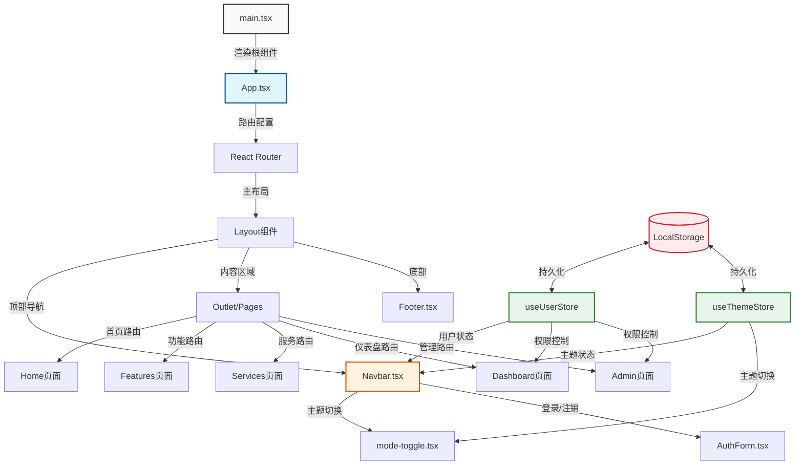

```mermaid
flowchart TD
    %% 应用初始化流程
    MainTsx[main.tsx] -->|渲染根组件| AppTsx[App.tsx]
    AppTsx -->|路由配置| RouterConfig[React Router]
    RouterConfig -->|主布局| Layout[Layout组件]
    
    %% 布局组件
    Layout -->|顶部导航| Navbar[Navbar.tsx]
    Layout -->|内容区域| ContentArea[Outlet/Pages]
    Layout -->|底部| Footer[Footer.tsx]
    
    %% 页面路由
    ContentArea -->|首页路由| Home[Home页面]
    ContentArea -->|功能路由| Features[Features页面]
    ContentArea -->|服务路由| Services[Services页面]
    ContentArea -->|仪表盘路由| Dashboard[Dashboard页面]
    ContentArea -->|管理路由| Admin[Admin页面]
    
    %% 状态管理
    UserStore[useUserStore] -->|用户状态| Navbar
    UserStore -->|权限控制| Dashboard
    UserStore -->|权限控制| Admin
    
    ThemeStore[useThemeStore] -->|主题状态| Navbar
    ThemeStore -->|主题切换| ModeToggle[mode-toggle.tsx]
    
    %% 组件交互
    Navbar -->|主题切换| ModeToggle
    Navbar -->|登录/注销| AuthForm[AuthForm.tsx]
    
    %% 数据流
    LocalStorage[(LocalStorage)] <-->|持久化| UserStore
    LocalStorage <-->|持久化| ThemeStore
    
    %% 样式
    style MainTsx fill:#f9f9f9,stroke:#333,stroke-width:2px
    style AppTsx fill:#e1f5fe,stroke:#01579b,stroke-width:2px
    style UserStore fill:#e8f5e9,stroke:#2e7d32,stroke-width:2px
    style ThemeStore fill:#e8f5e9,stroke:#2e7d32,stroke-width:2px
    style Navbar fill:#fff3e0,stroke:#e65100,stroke-width:2px
    style LocalStorage fill:#ffebee,stroke:#c62828,stroke-width:2px
```