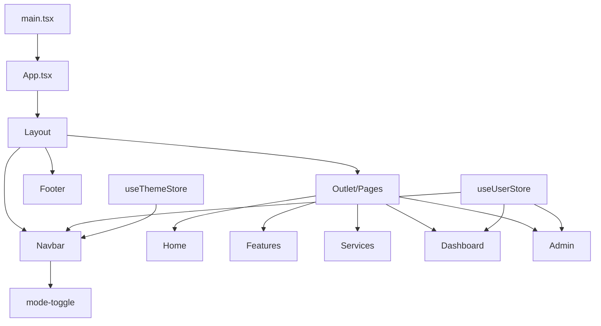
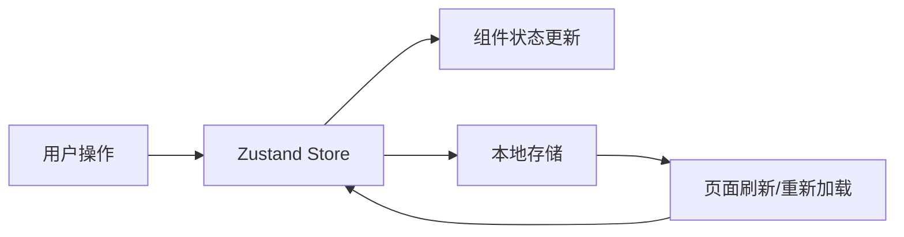

# MyWebsiteDemo 项目结构图

## 项目概述

这是一个基于 React + TypeScript + Vite 构建的现代化网站演示项目，使用 Tailwind CSS 进行样式设计，Zustand 进行状态管理。

## 技术栈

- **前端框架**: React 
- **构建工具**: Vite
- **语言**: TypeScript
- **样式**: Tailwind CSS
- **状态管理**: Zustand
- **路由**: React Router
- **SVG 处理**: vite-plugin-svgr

## 项目结构

```
MyWebsiteDemo/
├── public/                  # 静态资源目录
│   ├── myLogo.svg           # 网站 Logo
│   ├── vite.svg             # Vite Logo
│   ├── Weblogo.svg          # 网站 Logo 变体
│   └── icons/               # 图标资源
│
├── src/                     # 源代码目录
│   ├── assets/              # 项目资源
│   │   ├── icons/           # 图标资源
│   │   │   └── Weblogo.svg  # 网站 Logo
│   │   └── react.svg        # React Logo
│   │
│   ├── components/          # 可复用组件
│   │   ├── AuthCard/        # 认证卡片组件
│   │   ├── AuthForm.tsx     # 认证表单组件
│   │   ├── CardIcon.tsx     # 卡片图标组件
│   │   ├── DynamicIcon.tsx  # 动态图标组件
│   │   ├── EncryptIcons.tsx # 加密图标组件
│   │   ├── Footer.tsx       # 页脚组件
│   │   ├── mode-toggle.tsx  # 主题切换组件
│   │   ├── MyIcon.tsx       # 自定义图标组件
│   │   ├── Navbar.tsx       # 导航栏组件
│   │   ├── SideNavigationSeparator.jsx # 侧边导航分隔符
│   │   └── SvgLoader.tsx    # SVG 加载器组件
│   │
│   ├── hooks/               # 自定义 Hooks
│   │   └── useDynamicSvgImport.tsx # 动态 SVG 导入 Hook
│   │
│   ├── pages/               # 页面组件目录 (待实现)
│   │
│   ├── store/               # 状态管理
│   │   ├── index.ts         # 状态管理导出
│   │   ├── useThemeStore.ts # 主题状态管理
│   │   └── useUserStore.ts  # 用户状态管理
│   │
│   ├── types/               # 类型定义
│   │   ├── common.d.ts      # 通用类型定义
│   │   ├── svg.d.ts         # SVG 类型定义
│   │   └── theme.ts         # 主题类型定义
│   │
│   ├── App.css              # 应用样式
│   ├── App.tsx              # 应用主组件
│   ├── index.css            # 全局样式
│   ├── main.tsx             # 应用入口
│   └── vite-env.d.ts        # Vite 环境类型定义
│
├── .gitignore               # Git 忽略文件
├── components.json          # 组件配置
├── eslint.config.js         # ESLint 配置
├── index.html               # HTML 入口
├── LICENSE                  # 许可证
├── package.json             # 项目依赖和脚本
├── pnpm-lock.yaml           # pnpm 锁文件
├── README.md                # 项目说明
├── tailwind.config.js       # Tailwind 配置
├── tsconfig.app.json        # TypeScript 应用配置
├── tsconfig.json            # TypeScript 基础配置
├── tsconfig.node.json       # TypeScript Node 配置
└── vite.config.ts           # Vite 配置
```

## 核心功能模块

### 1. 用户认证系统
- 使用 Zustand 管理用户状态 (useUserStore.ts)
- 提供登录/注销功能
- 持久化用户状态到 localStorage

### 2. 主题管理
- 支持亮色/暗色/系统主题 (useThemeStore.ts)
- 主题切换功能
- 持久化主题设置

### 3. 路由系统
- 使用 React Router 进行路由管理
- 支持嵌套路由
- 布局组件共享导航栏和页脚

### 4. UI 组件
- 导航栏 (Navbar.tsx)
- 页脚 (Footer.tsx)
- 认证表单 (AuthForm.tsx)
- 图标系统 (MyIcon.tsx, DynamicIcon.tsx)

## 应用架构



## 状态管理流程

