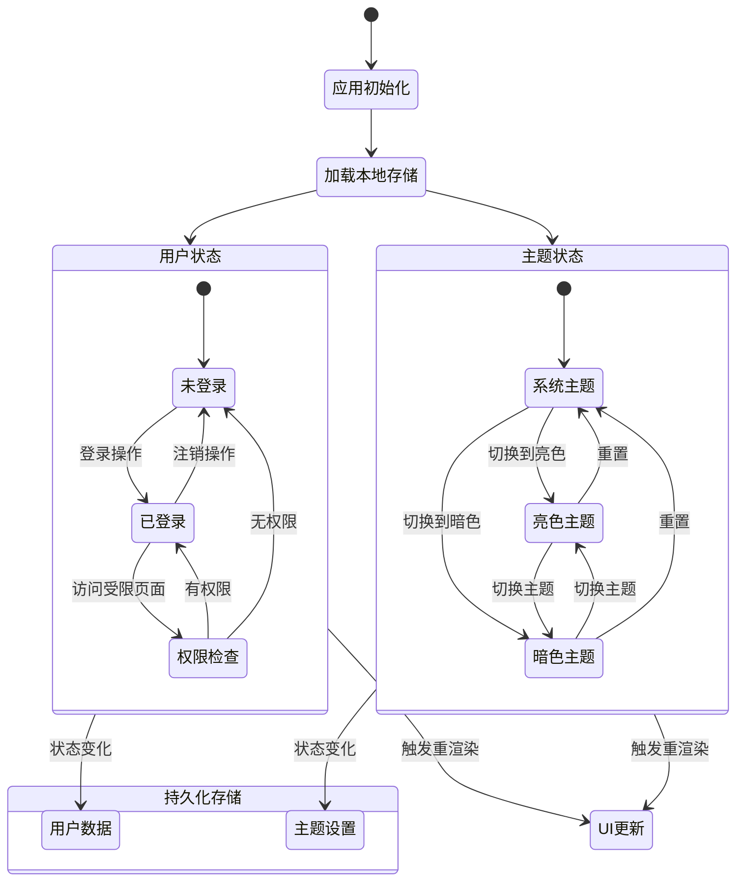

```mermaid
stateDiagram-v2
    [*] --> 初始化
    
    state "应用初始化" as 初始化
    state "加载本地存储" as 加载存储
    state "用户状态" as 用户状态 {
        [*] --> 未登录
        未登录 --> 已登录: 登录操作
        已登录 --> 未登录: 注销操作
        state "权限检查" as 权限检查
        已登录 --> 权限检查: 访问受限页面
        权限检查 --> 已登录: 有权限
        权限检查 --> 未登录: 无权限
    }
    
    state "主题状态" as 主题状态 {
        [*] --> 系统主题
        系统主题 --> 亮色主题: 切换到亮色
        系统主题 --> 暗色主题: 切换到暗色
        亮色主题 --> 暗色主题: 切换主题
        暗色主题 --> 亮色主题: 切换主题
        亮色主题 --> 系统主题: 重置
        暗色主题 --> 系统主题: 重置
    }
    
    初始化 --> 加载存储
    加载存储 --> 用户状态
    加载存储 --> 主题状态
    
    state "持久化存储" as 持久化 {
        state "用户数据" as 用户数据
        state "主题设置" as 主题设置
    }
    
    用户状态 --> 用户数据: 状态变化
    主题状态 --> 主题设置: 状态变化
    
    state "UI更新" as UI更新
    用户状态 --> UI更新: 触发重渲染
    主题状态 --> UI更新: 触发重渲染
```